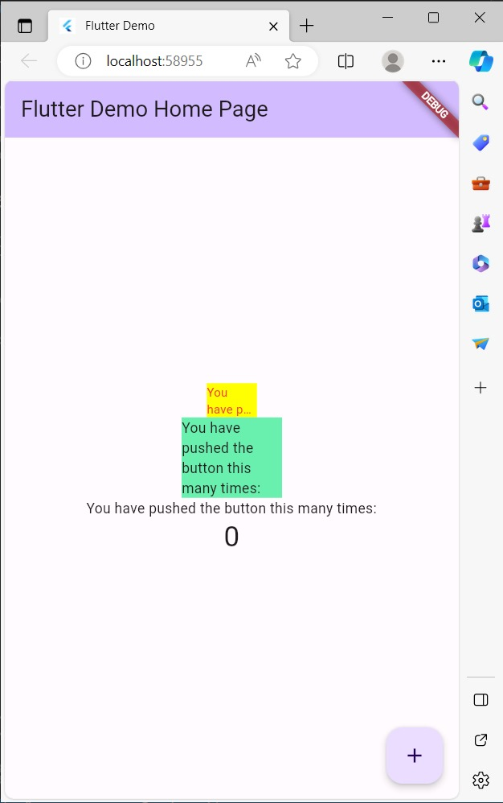

# Laporan Praktikum Manajemen Plugin Minggu 10

NAMA : MIRZA PRISCILLA FARADIBA

KELAS : TI-3A

NO.ABSEN : 18

### Langkah 1: Buat Project Baru
Buatlah sebuah project flutter baru dengan nama flutter_plugin_pubdev. Lalu jadikan repository di GitHub Anda dengan nama flutter_plugin_pubdev.

### Langkah 2: Menambahkan Plugin
Tambahkan plugin auto_size_text menggunakan perintah berikut di terminal

Jika berhasil, maka akan tampil nama plugin beserta versinya di file pubspec.yaml pada bagian dependencies.

### Langkah 3: Buat file red_text_widget.dart

Buat file baru bernama red_text_widget.dart di dalam folder lib lalu isi kode seperti berikut.

```
import 'package:flutter/material.dart';

class RedTextWidget extends StatelessWidget {
  const RedTextWidget({Key? key}) : super(key: key);

  @override
  Widget build(BuildContext context) {
    return Container();
  }
}
```
### Langkah 4: Tambah Widget AutoSizeText

Masih di file red_text_widget.dart, untuk menggunakan plugin auto_size_text, ubahlah kode return Container() menjadi seperti berikut.

```
return AutoSizeText(
      text,
      style: const TextStyle(color: Colors.red, fontSize: 14),
      maxLines: 2,
      overflow: TextOverflow.ellipsis,
);
```
Setelah Anda menambahkan kode di atas, Anda akan mendapatkan info error. Mengapa demikian? Jelaskan dalam laporan praktikum Anda!

Jawab : Error karena belum ditambahkan variabel String

### Langkah 5: Buat Variabel text dan parameter di constructor

Tambahkan variabel text dan parameter di constructor seperti berikut.

```
final String text;

const RedTextWidget({Key? key, required this.text}) : super(key: key);
```
### Langkah 6: Tambahkan widget di main.dart

Buka file main.dart lalu tambahkan di dalam children: pada class _MyHomePageState

```
Container(
   color: Colors.yellowAccent,
   width: 50,
   child: const RedTextWidget(
             text: 'You have pushed the button this many times:',
          ),
),
Container(
    color: Colors.greenAccent,
    width: 100,
    child: const Text(
           'You have pushed the button this many times:',
          ),
),
```

### Output



# Tugas Praktikum

1. Selesaikan Praktikum Menerapkan Plugin di Project Flutter diatas, lalu dokumentasikan dan push ke repository Anda berupa screenshot hasil pekerjaan beserta penjelasannya di file README.md!

2. Jelaskan maksud dari langkah 2 pada praktikum tersebut!

    Jawab : Maksud dari langkah praktikum tersebut adalah menambahkan plugin bernama "auto_size_text" ke dalam proyek Flutter dengan menjalankan perintah flutter pub add auto_size_text di terminal. Hasilnya, nama plugin dan versinya akan ditambahkan ke file konfigurasi proyek Flutter (pubspec.yaml) di bagian dependencies.


3. Jelaskan maksud dari langkah 5 pada praktikum tersebut!

    Jawab : Maksud dari langkah tersebut adalah menambahkan variabel bernama "text"  bertipe data string dan memiliki kata kunci final yang artinya tidak dapat diubah, setelah widget dibuat untuk menyimpan teks yang akan ditampilkan oleh widget "RedTextWidget." Selain itu, juga menambahkan parameter "text" ke constructor widget ini, yang harus diisi saat membuat instance widget ini. Ini memungkinkan pengguna widget "RedTextWidget" untuk menentukan teks yang akan ditampilkan oleh widget tersebut saat menggunakannya.

4. Pada langkah 6 terdapat dua widget yang ditambahkan, jelaskan fungsi dan perbedaannya!

    Jawab :

    1. Container Widget (Warna Kuning):
    Fungsi: Container digunakan untuk mengatur tampilan dan layout dari widget di dalamnya. Dalam contoh ini, Container memiliki latar belakang warna kuning (Colors.yellowAccent) dan lebar sebesar 50.
    Child: Di dalam Container ini, terdapat widget "RedTextWidget" yang Anda definisikan sebelumnya. "RedTextWidget" memiliki teks tetap ("You have pushed the button this many times:") yang akan ditampilkan dengan warna merah.
    2. Container Widget (Warna Hijau):
    Fungsi: Seperti yang lain, Container digunakan untuk mengatur tampilan dan layout. Dalam contoh ini, Container memiliki latar belakang warna hijau (Colors.greenAccent) dan lebar sebesar 100.
    Child: Di dalam Container ini, terdapat widget bawaan Flutter yaitu "Text," yang juga memiliki teks tetap ("You have pushed the button this many times:").

    Perbedaannya terletak pada konten yang ditampilkan dan penggunaan widget:
    Container dengan warna kuning menggunakan widget kustom "RedTextWidget" yang akan menampilkan teks dengan warna merah sesuai dengan namanya.
    Container dengan warna hijau menggunakan widget bawaan "Text" dari Flutter untuk menampilkan teks tanpa warna khusus.

5. . Jelaskan maksud dari tiap parameter yang ada di dalam plugin auto_size_text berdasarkan tautan pada dokumentasi ini !

    Jawab :

- minFontSize : digunakan untuk mengatur ukuran teks sekecil mungkin standarnya adalah 12.
- maxFontSize : digunakan untuk mengatur teks sebesar mungkin.
- AutoSizeGroup : digunakan untuk menggabung beberapa autosizetext dalam satu grup.
- stepGranularitymenentukan seberapa besar ukuran font dikurangi setiap langkah.
- presentFontSize : digunakan untuk mendefinisikan ukuran font terlebih dahulu.
- overflowReplacement : menampilka wdget jika teks tidak sesuai batas.

